# Sistema de Gestão de Vendas e Stock com Assistente de IA

Este é um sistema web completo para a gestão de um negócio de retalho com múltiplas filiais.  
A aplicação foi desenvolvida em **Go (Golang)**, utiliza **PostgreSQL** como base de dados e integra um **assistente de Inteligência Artificial** para análise de dados em tempo real.

---

## Funcionalidades Principais

- **Autenticação por Cargos**: Sistema de login seguro que direciona os utilizadores para painéis específicos:
  - **Painel de Administrador**: Visão completa do negócio com gestão de utilizadores, catálogo de produtos, stock por filial, dados da empresa, sócios e relatórios de vendas.
  - **Painel de Estoquista**: Interface focada na gestão de stock da sua filial, permitindo a adição de novos produtos e a entrada de stock para itens existentes.
  - **Terminal de Vendas (PDV)**: Ponto de Venda rápido e interativo para os vendedores, com busca de produtos e registo de transações.

- **Dashboard de Monitoramento (Admin)**: Página visual com KPIs (faturamento, transações, ticket médio), gráfico de vendas diárias por filial e lista de alertas de stock baixo.

- **Assistente de IA (Chatbot)**: Um chat flutuante disponível para todos os perfis, capaz de:
  - Analisar o faturamento por filial.
  - Gerar um ranking dos melhores vendedores.
  - Listar produtos com stock baixo.
  - Filtrar o catálogo de produtos por categoria e preço.

---

## Arquitetura da Inteligência Artificial

A integração da IA foi desenhada com foco em **segurança, controlo e flexibilidade**, utilizando a técnica de **"Tool Calling"**.

### Padrão de "Proxy" Seguro

A chave de API (seja da Gemini ou de outro serviço) **nunca é exposta no frontend**.

Fluxo de comunicação:
1. **Frontend (`chat.js`)** → envia a pergunta para `/api/chat`.
2. **Backend (`handlers.go`)** → lê a chave API de forma segura nas variáveis de ambiente.
3. **Chamada à API da IA** → devolve a resposta processada para o frontend.

---

### Técnica Central: "Tool Calling"

1. **Pensamento**:  
   Exemplo — Pergunta: *"Qual filial vendeu mais este mês?"*.  
   IA responde com:  
   ```json
   {"functionCall": "getTopBillingBranch", "period": "month"}

2. **Resposta**:
   O `chat.js` executa a função, envia os dados reais para a IA e recebe a resposta final formatada.


## Implementação com Google Gemini vs. Ollama

* **Google Gemini**: Suporte nativo a "Tool Calling".
* **Ollama (Llama 3)**: Implementado via *Prompt Engineering*, simulando o retorno JSON.


## Relatório Visual dos Testes de Frontend

<h3 align="center">Fluxo Completo da Aplicação</h3>
<table width="100%" border="1" style="border-collapse: collapse; margin: auto;">
<thead>
<tr style="background-color: #f2f2f2;">
<th style="padding: 10px; text-align: center;">Passo do Teste</th>
<th style="padding: 10px; text-align: center;">Passo Seguinte</th>
</tr>
</thead>
<tbody>
<tr>
<td style="padding: 10px;">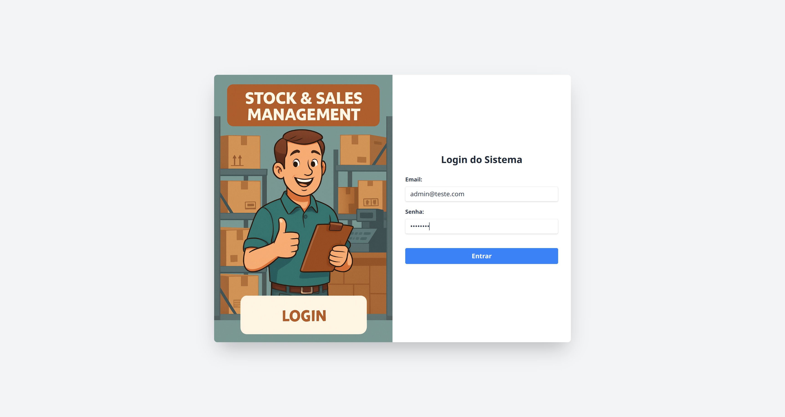</td>
<td style="padding: 10px;">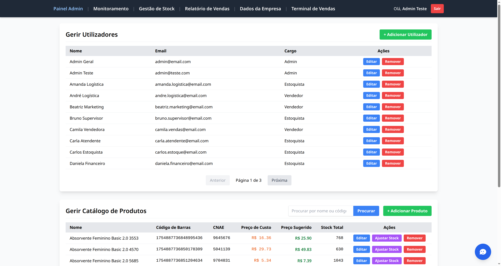</td>
</tr>
<tr>
<td style="padding: 10px;">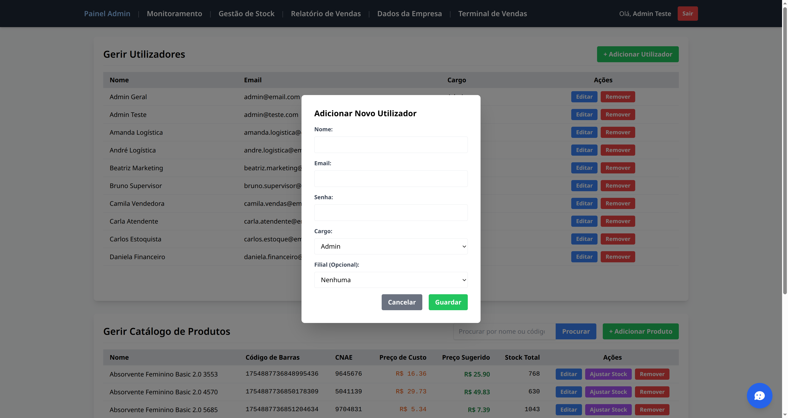</td>
<td style="padding: 10px;">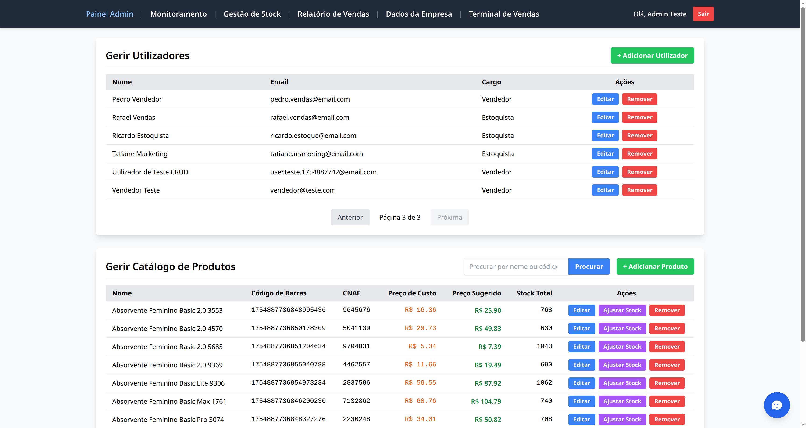</td>
</tr>
<tr>
<td style="padding: 10px;">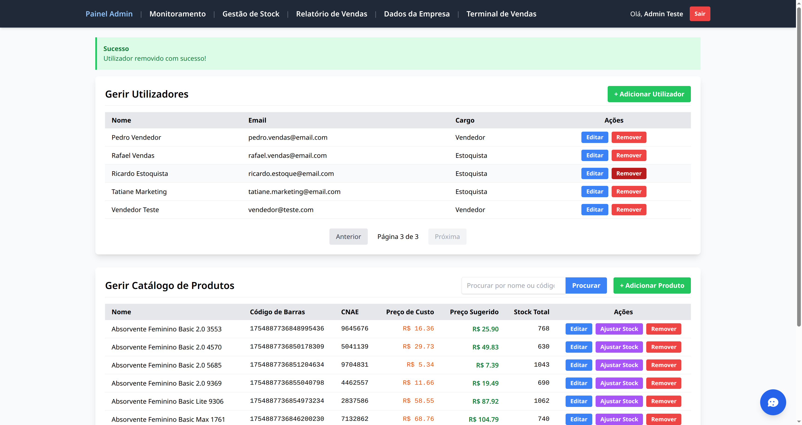</td>
<td style="padding: 10px;">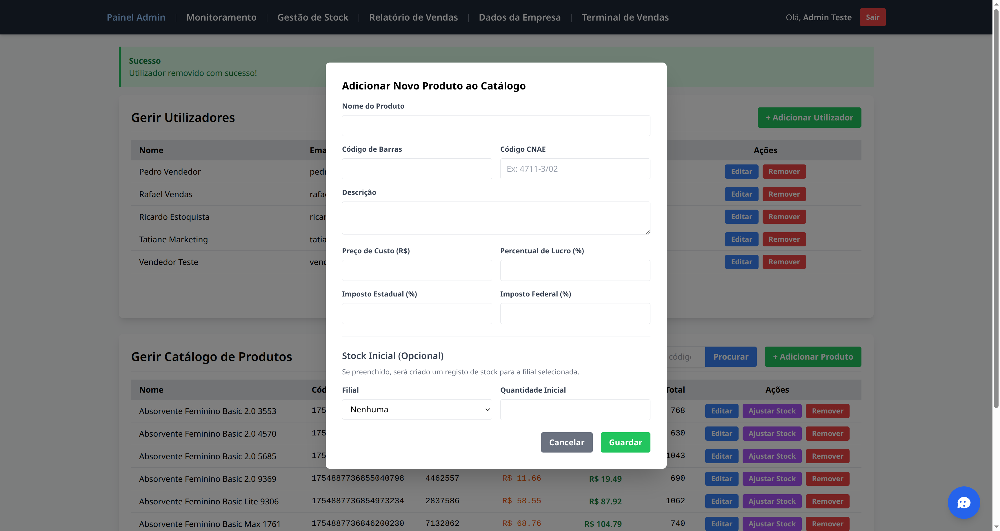</td>
</tr>
<tr>
<td style="padding: 10px;">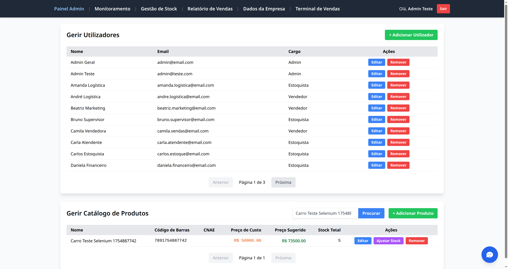</td>
<td style="padding: 10px;">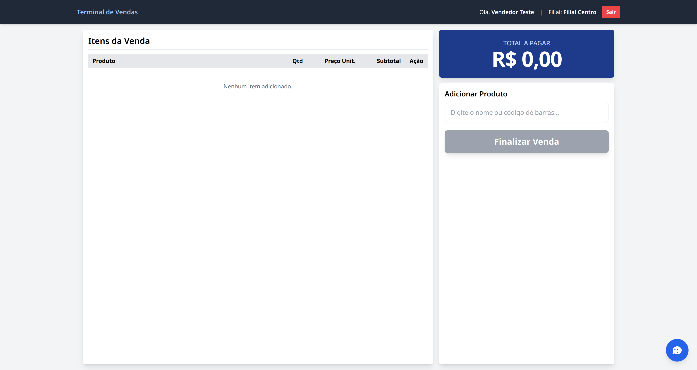</td>
</tr>
<tr>
<td style="padding: 10px;"></td>
<td style="padding: 10px;">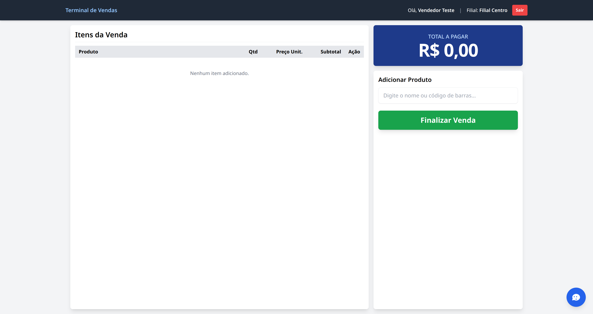</td>
</tr>
<tr>
<td style="padding: 10px;"></td>
<td style="padding: 10px;"></td>
</tr>
<tr>
<td style="padding: 10px;"></td>
<td style="padding: 10px;"></td>
</tr>
<tr>
<td style="padding: 10px;">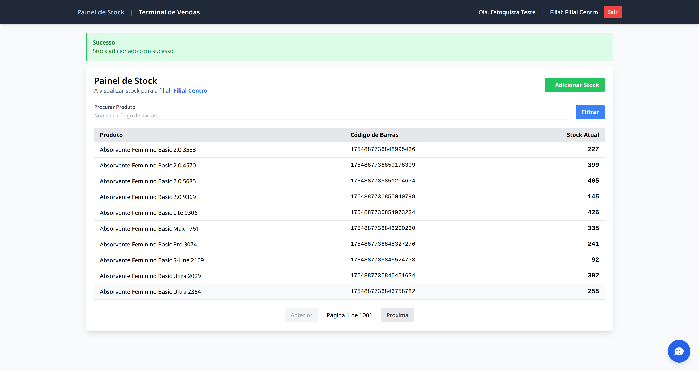</td>
<td style="padding: 10px;">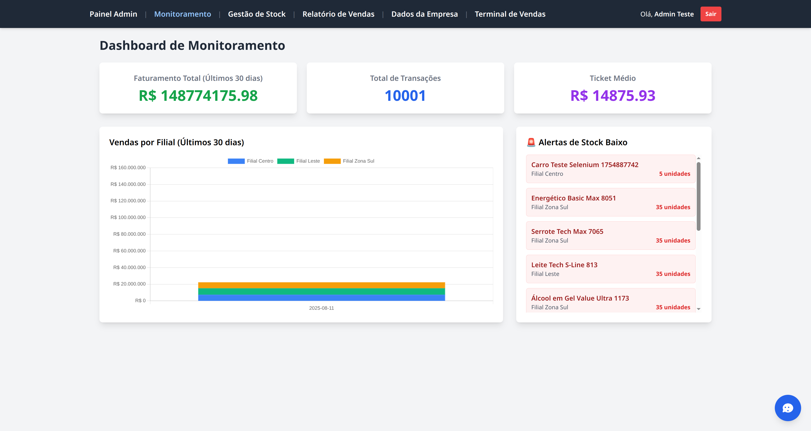</td>
</tr>
</tbody>
</table>


## Tecnologias Utilizadas

* **Backend**: Go (Golang)
* **Framework Web**: Gin Gonic
* **Base de Dados**: PostgreSQL
* **Frontend**: HTML5, Tailwind CSS, JavaScript, Chart.js
* **Inteligência Artificial**: Google Gemini / Ollama (Llama 3)
* **Testes**:

  * Backend: Pacote `testing` nativo do Go.
  * Frontend (E2E): Python com Selenium.


## Configuração e Execução

*(Esta secção permanece igual)*


## Licença

Este projeto está licenciado sob a Licença MIT.

Licença MIT
Copyright (c) 2025 Seu Nome ou Nome da Empresa

É concedida permissão, gratuitamente, a qualquer pessoa que obtenha uma cópia deste software e dos ficheiros de documentação associados (o "Software"), para negociar o Software sem restrições, incluindo, sem limitação, os direitos de usar, copiar, modificar, fundir, publicar, distribuir, sublicenciar e/ou vender cópias do Software, e para permitir que as pessoas a quem o Software é fornecido o façam, sujeito às seguintes condições:

O aviso de direitos de autor acima e este aviso de permissão devem ser incluídos em todas as cópias ou partes substanciais do Software.

O SOFTWARE É FORNECIDO "COMO ESTÁ", SEM GARANTIA DE QUALQUER TIPO, EXPRESSA OU IMPLÍCITA, INCLUINDO, MAS NÃO SE LIMITANDO A, GARANTIAS DE COMERCIALIZAÇÃO, ADEQUAÇÃO A UM DETERMINADO FIM E NÃO INFRAÇÃO. EM NENHUM CASO OS AUTORES OU DETENTORES DOS DIREITOS DE AUTOR SERÃO RESPONSÁVEIS POR QUALQUER RECLAMAÇÃO, DANOS OU OUTRA RESPONSABILIDADE, SEJA NUMA AÇÃO DE CONTRATO, DELITO OU OUTRA FORMA, DECORRENTE DE, FORA DE OU EM CONEXÃO COM O SOFTWARE OU O USO OU OUTRAS NEGOCIAÇÕES NO SOFTWARE.
