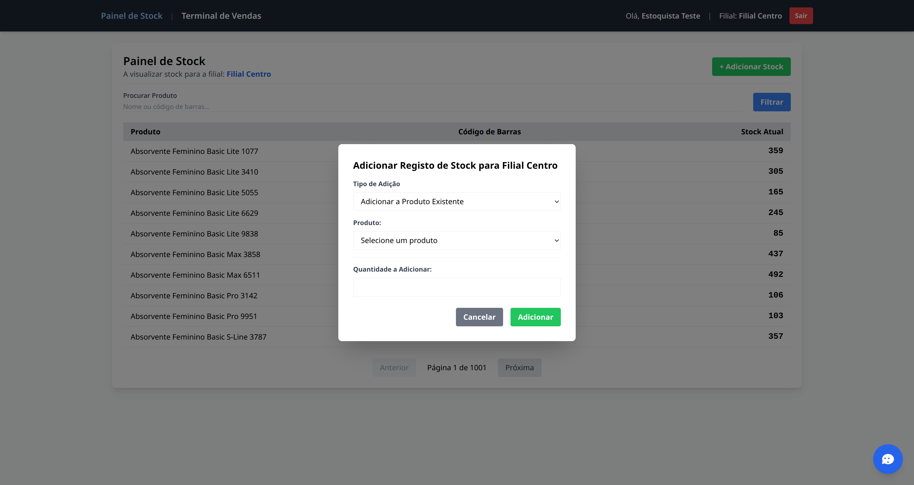

# Sistema de Gestão de Vendas e Stock com Assistente de IA

Este é um sistema web completo para a gestão de um negócio de retalho com múltiplas filiais. A aplicação foi desenvolvida em Go (Golang), utiliza PostgreSQL como base de dados e integra um assistente de Inteligência Artificial para análise de dados em tempo real.

## Funcionalidades Principais

* **Autenticação por Cargos:** Sistema de login seguro que direciona os utilizadores para painéis específicos:
    * **Painel de Administrador:** Visão completa do negócio com gestão de utilizadores, catálogo de produtos, stock por filial, dados da empresa, sócios e relatórios de vendas.
    * **Painel de Estoquista:** Interface focada na gestão de stock da sua filial, permitindo a adição de novos produtos e a entrada de stock para itens existentes.
    * **Terminal de Vendas (PDV):** Ponto de Venda rápido e interativo para os vendedores, com busca de produtos e registo de transações.
* **Dashboard de Monitoramento (Admin):** Uma página de gestão visual com KPIs (faturamento, transações, ticket médio), um gráfico de vendas diárias por filial e uma lista de alertas de stock baixo.
* **Assistente de IA (Chatbot):** Um chat flutuante disponível para todos os perfis, capaz de responder a perguntas em linguagem natural e executar ações, como:
    * Analisar o faturamento por filial.
    * Gerar um ranking dos melhores vendedores.
    * Listar produtos com stock baixo.
    * Filtrar o catálogo de produtos por categoria e preço.

## Arquitetura da Inteligência Artificial

A integração da IA foi desenhada com foco em segurança, controlo e flexibilidade, utilizando a técnica de **"Tool Calling"**.

### Padrão de "Proxy" Seguro

A chave de API (seja da Gemini ou de outro serviço) **nunca é exposta no frontend**. O fluxo de comunicação é o seguinte:

1.  **Frontend (`chat.js`):** O chat envia a pergunta do utilizador para um endpoint seguro na nossa própria API em Go (`/api/chat`).
2.  **Backend (Go - `handlers.go`):** O nosso servidor atua como um intermediário. Ele recebe o pedido, lê a chave de API de forma segura a partir das variáveis de ambiente, faz a chamada para a API externa da IA e devolve apenas a resposta final para o frontend.

### Técnica Central: "Tool Calling"

Em vez de apenas conversar, demos à IA um conjunto de "ferramentas" (funções) que ela pode usar para obter informações do nosso sistema.

1.  **Passo de "Pensamento":** O utilizador pergunta "qual filial vendeu mais este mês?". A IA, em vez de adivinhar, analisa as suas ferramentas e responde com uma instrução, como: `{"functionCall": "getTopBillingBranch", "period": "month"}`.
2.  **Passo de "Resposta":** O nosso `chat.js` recebe esta instrução, executa a função correspondente (chamando a nossa API em Go), obtém os dados reais e envia-os de volta para a IA, dizendo: "Aqui está o resultado. Agora, formule uma resposta amigável para o utilizador."

#### Implementação com Google Gemini (Nativo) vs. Ollama (Simulado)

* **Google Gemini:** Usamos o suporte nativo da Gemini para "Tool Calling", definindo as nossas ferramentas e os seus parâmetros de forma estruturada. A API da Gemini devolve um objeto `functionCall` claro, o que torna a implementação mais robusta.
* **Ollama (Llama 3):** Como modelos locais não têm esta funcionalidade nativa, nós a **simulamos** através de *Prompt Engineering*. Instruímos o modelo no `systemPrompt` a devolver um JSON com uma estrutura específica sempre que a pergunta do utilizador corresponder a uma das nossas ferramentas.

## Relatório Visual dos Testes de Frontend

<h3 align="center">Fluxo Completo da Aplicação</h3>
<table width="100%" border="1" style="border-collapse: collapse; margin: auto;">
<thead>
<tr style="background-color: #f2f2f2;">
<th style="padding: 10px; text-align: center;">Passo do Teste</th>
<th style="padding: 10px; text-align: center;">Passo Seguinte</th>
</tr>
</thead>
<tbody>
<tr>
<td style="padding: 10px;"></td>
<td style="padding: 10px;"></td>
</tr>
<tr>
<td style="padding: 10px;"></td>
<td style="padding: 10px;"></td>
</tr>
<tr>
<td style="padding: 10px;"></td>
<td style="padding: 10px;"></td>
</tr>
<tr>
<td style="padding: 10px;"></td>
<td style="padding: 10px;"></td>
</tr>
<tr>
<td style="padding: 10px;"></td>
<td style="padding: 10px;"></td>
</tr>
<tr>
<td style="padding: 10px;"></td>
<td style="padding: 10px;"></td>
</tr>
<tr>
<td style="padding: 10px;"></td>
<td style="padding: 10px;"></td>
</tr>
<tr>
<td style="padding: 10px;"></td>
<td style="padding: 10px;"></td>
</tr>
</tbody>
</table>

## Tecnologias Utilizadas

* **Backend:** Go (Golang)
* **Framework Web:** Gin Gonic
* **Base de Dados:** PostgreSQL
* **Frontend:** HTML5, Tailwind CSS, JavaScript, Chart.js
* **Inteligência Artificial:** Google Gemini / Ollama (Llama 3)
* **Testes:**
    * **Backend:** Pacote `testing` nativo do Go.
    * **Frontend (E2E):** Python com Selenium.

## Configuração e Execução

### 1. Pré-requisitos

* Go (versão 1.18 ou superior)
* PostgreSQL
* Python 3 (para os testes de frontend)
* Google Chrome e ChromeDriver (para os testes de frontend)

### 2. Configurar a Base de Dados

É recomendado usar um container para a base de dados para garantir um ambiente limpo e isolado.

```bash
# Exemplo com Podman (ou Docker)
podman run --rm --name postgres-vendas -e POSTGRES_PASSWORD=1q2w3e -e POSTGRES_USER=me -p 5432:5432 -d postgres:latest
````

### 3\. Configurar Variáveis de Ambiente

Crie um ficheiro chamado `config.env` na raiz do projeto:

```env
# Configuração da Base de Dados
DB_HOST=localhost
DB_USER=me
DB_PASS=1q2w3e
DB_NAME=wallmart

# Configuração da IA (Opcional, apenas para o chat)
GEMINI_API_KEY=SUA_CHAVE_DE_API_AQUI
GEMINI_MODEL=gemini-1.5-flash-latest
```

### 4\. Iniciar e Popular a Base de Dados

Com o container do PostgreSQL a correr, execute os seguintes comandos a partir da raiz do projeto:

```bash
# 1. Cria a base de dados 'wallmart' e todas as tabelas
go run ./cmd/data_manager/main.go -init

# 2. (Opcional) Popula o banco com dados de teste (produtos, filiais, utilizadores, vendas, etc.)
go run ./cmd/populando_banco/main.go
```

### 5\. Iniciar a Aplicação

Para executar o sistema em modo de desenvolvimento:

```bash
go run ./cmd/api/main.go
```

A aplicação estará disponível em `http://localhost:8080`.

## Build para Produção

Para compilar a aplicação num único ficheiro executável, use o comando `go build`. Isto irá criar um binário otimizado que pode ser executado em qualquer servidor sem precisar do código-fonte do Go.

```bash
# Compila a API principal
go build -o vendas_api ./cmd/api/main.go

# Compila a ferramenta de gestão de dados
go build -o data_manager ./cmd/data_manager/main.go
```

Depois de compilado, pode simplesmente executar o binário:
`./vendas_api`

## Licença

Este projeto está licenciado sob a Licença MIT.

### Licença MIT

Copyright (c) 2025 Seu Nome ou Nome da Empresa

É concedida permissão, gratuitamente, a qualquer pessoa que obtenha uma cópia deste software e dos ficheiros de documentação associados (o "Software"), para negociar o Software sem restrições, incluindo, sem limitação, os direitos de usar, copiar, modificar, fundir, publicar, distribuir, sublicenciar e/ou vender cópias do Software, e para permitir que as pessoas a quem o Software é fornecido o façam, sujeito às seguintes condições:

O aviso de direitos de autor acima e este aviso de permissão devem ser incluídos em todas as cópias ou partes substanciais do Software.

O SOFTWARE É FORNECIDO "COMO ESTÁ", SEM GARANTIA DE QUALQUER TIPO, EXPRESSA OU IMPLÍCITA, INCLUINDO, MAS NÃO SE LIMITANDO A, GARANTIAS DE COMERCIALIZAÇÃO, ADEQUAÇÃO A UM DETERMINADO FIM E NÃO INFRAÇÃO. EM NENHUM CASO OS AUTORES OU DETENTORES DOS DIREITOS DE AUTOR SERÃO RESPONSÁVEIS POR QUALQUER RECLAMAÇÃO, DANOS OU OUTRA RESPONSABILIDADE, SEJA NUMA AÇÃO DE CONTRATO, DELITO OU OUTRA FORMA, DECORRENTE DE, FORA DE OU EM CONEXÃO COM O SOFTWARE OU O USO OU OUTRAS NEGOCIAÇÕES NO SOFTWARE.
